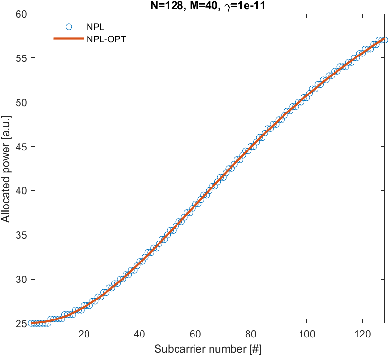

# Nonlinear Power Loading (NPL) Algorithm

[](https://doi.org/10.5281/zenodo.15046844)
[](https://www.mathworks.com/products/matlab.html)
[](https://www.gnu.org/licenses/lgpl-3.0)
[](https://matlab.mathworks.com/open/github/v1?repo=juliusz-b/npl)

## Overview

This repository provides MATLAB implementations of the Nonlinear Power Loading (NPL) algorithm for optical wireless communication systems using LEDs. NPL maximizes transmission capacity while minimizing nonlinear distortion generated in LED transmitters.

Unlike conventional power loading algorithms that treat nonlinear distortion as additive noise, NPL specifically accounts for the nonlinear characteristics of the channel, resulting in up to 10% throughput improvement compared to classical approaches.

## Algorithm Implementations

The repository contains two implementations of the NPL algorithm:

### 1. NPL (Iterative Approach)

```matlab
[Ak, Pnpl] = npl(G, N0, gamma, S, N, M, Delta)
```

This implementation uses an iterative approach where power is incrementally allocated (Delta) to whichever subcarrier yields the maximum capacity increment. The algorithm continues until the total power limit is reached.

### 2. NPL_OPT (Optimization Approach)

```matlab
[Ak, Pnpl] = npl_opt(G, N0, gamma, S, N, M)
```

This implementation uses MATLAB's optimization functions (`fmincon`) with analytical gradients to directly find the optimal power allocation that maximizes capacity. This approach is generally faster and more accurate than the iterative method.

## Parameters

Both functions use the following parameters:

| Parameter | Description |
|-----------|-------------|
| G         | Channel linear response vector |
| N0        | Noise spectral density |
| gamma     | LED nonlinearity coefficient |
| S         | Nonlinear distortion power spectral distribution |
| N         | Number of subcarriers |
| M         | Average power multiplier |
| Delta     | Power increment step size (only for `npl`) |

## Return Values

Both functions return:

| Value | Description |
|-------|-------------|
| Ak    | Final power-loading amplitudes across subcarriers |
| Pnpl  | Final power-loading values across subcarriers |

## Usage Example

The repository includes a ready-to-use example script (`nplExample.m`) that demonstrates both NPL implementations:

```matlab
% Set OFDM bandwidth to 100 MHz
BW = 100e6;

% Number of subcarriers
N = 128;

% 3 dB cut-off frequency of the LED
f3dB = 45e6;

% Noise power spectral density
N0 = 1e-4;

% Frequency vector
f = (0:(N-1))/N*BW;

% Channel response modeling (low-pass filter model)
G = abs(1./(1 + 1i * f / f3dB));

% LED nonlinearity coefficient
gamma = 1e-11;

% Nonlinear distortion power spectral distribution
fA = 1e6;
S = (f3dB^4 * (4*f.^2 + fA^2)) ./ (fA^2 * (4*f.^2 + f3dB^2) .* (f.^2 + f3dB^2));
S = S / max(S);

% NPL parameters
M = 40;        % Average power multiplier
Delta = 0.5;   % Power increment step for iterative method

% Run both NPL implementations
[~, Pnpl] = npl(G, N0, gamma, S, N, M, Delta);
[~, Pnpl_opt] = npl_opt(G, N0, gamma, S, N, M);

% Compare results
figure('color','w');
plot(1:N, Pnpl, 'o');
hold on;
plot(1:N, Pnpl_opt, '-', 'LineWidth', 2);
xlim([1 N])
legend({'NPL','NPL-OPT'}, 'Box', 'off', 'Location', 'best')
title(['N=' num2str(N) ', M=' num2str(M) ', \gamma=' num2str(gamma)])
xlabel('Subcarrier number [#]')
ylabel('Allocated power [a.u.]')
```

This example creates a simulated low-pass channel response typical for LED-based communication systems, configures the nonlinear distortion model, and applies both NPL algorithms to optimize power allocation.

## Results Comparison

The following figure shows a comparison between the two NPL implementations with parameters N=128, M=40, γ=1e-11:



The figure demonstrates that both algorithms produce very similar power allocation patterns across subcarriers. The optimization-based approach (NPL-OPT) produces a smoother allocation curve compared to the iterative approach (NPL), while achieving essentially the same power distribution pattern.

## Repository Contents

This repository contains the following key files:

- **npl.m** - Implementation of the iterative Nonlinear Power Loading algorithm
- **npl_opt.m** - Implementation of the optimization-based NPL algorithm using analytical gradients
- **nplExample.m** - Example script demonstrating both implementations on a simulated channel
- **nplVisualization.m** - Script that creates an animated visualization of the NPL algorithm operation
- **exp_values.mat** - Experimental data from real-world optical wireless communication tests

## Visualization

The repository includes a visualization script (`nplVisualization.m`) that demonstrates the NPL algorithm's operation over time. This script:

1. Loads experimental data from `exp_values.mat`
2. Runs the NPL algorithm while recording intermediate values
3. Creates an animated visualization showing:
   - Capacity calculations for each subcarrier
   - SINR distribution
   - Power distribution over iterations
   - Nonlinear distortion effects

The visualization can be rendered as an MP4 video with synchronized audio cues that indicate when power is allocated to different subcarriers.

## Citation

If you use this code in your research, please cite our paper (for the original NPL used in OFDM):

```bibtex
@article{Kasjanowicz2023,
  title = {Bit and Power Loading Algorithms for Nonlinear Optical Wireless Communication Channels},
  volume = {27},
  ISSN = {2373-7891},
  url = {http://dx.doi.org/10.1109/LCOMM.2023.3332108},
  DOI = {10.1109/lcomm.2023.3332108},
  number = {12},
  journal = {IEEE Communications Letters},
  publisher = {Institute of Electrical and Electronics Engineers (IEEE)},
  author = {Kasjanowicz,  Jakub and Bojarczuk,  Juliusz and Stepniak,  Grzegorz},
  year = {2023},
  month = dec,
  pages = {3270–3274}
}
```
[](https://doi.org/10.1109/LCOMM.2023.3332108)

and

```bibtex
@article{Kasjanowicz2025,
  title = {Balancing Noise and Nonlinear Distortion by Power Loading in FBMC OWC},
  ISSN = {2155-3165},
  url = {http://dx.doi.org/10.1364/AO.562794},
  DOI = {10.1364/ao.562794},
  journal = {Applied Optics},
  publisher = {Optica Publishing Group},
  author = {Kasjanowicz,  Jakub and Bojarczuk,  Juliusz and Araszkiewicz,  Piotr and Stepniak,  Grzegorz},
  year = {2025},
  month = may 
}

```
[](https://doi.org/10.1364/AO.562794)

for the NPL used in FBMC.


## License

This project is licensed under the LGPL v3 License - see the LICENSE file for details.

## Contributors

- Jakub Kasjanowicz - Warsaw University of Technology
- Juliusz Bojarczuk - Warsaw University of Technology
- Grzegorz Stepniak - Warsaw University of Technology
